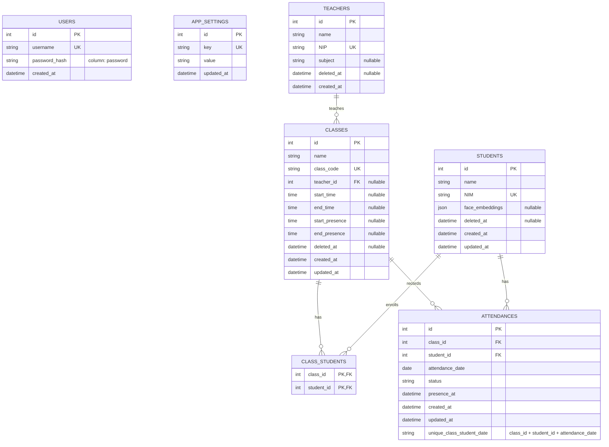

# Henokh Project ERD

This ERD is based on `models/db_models.py` and uses Mermaid crow's-foot notation.

## Visual Diagram

Open `henokh_erd.svg` to view the rendered diagram.

## Relationship Notes

- One teacher can teach zero or many classes.
- A class can have zero or many students through `class_students`.
- A student can join zero or many classes through `class_students`.
- A class can have zero or many attendance records.
- A student can have zero or many attendance records.
- `attendances` has a unique constraint on `class_id`, `student_id`, and `attendance_date`.
